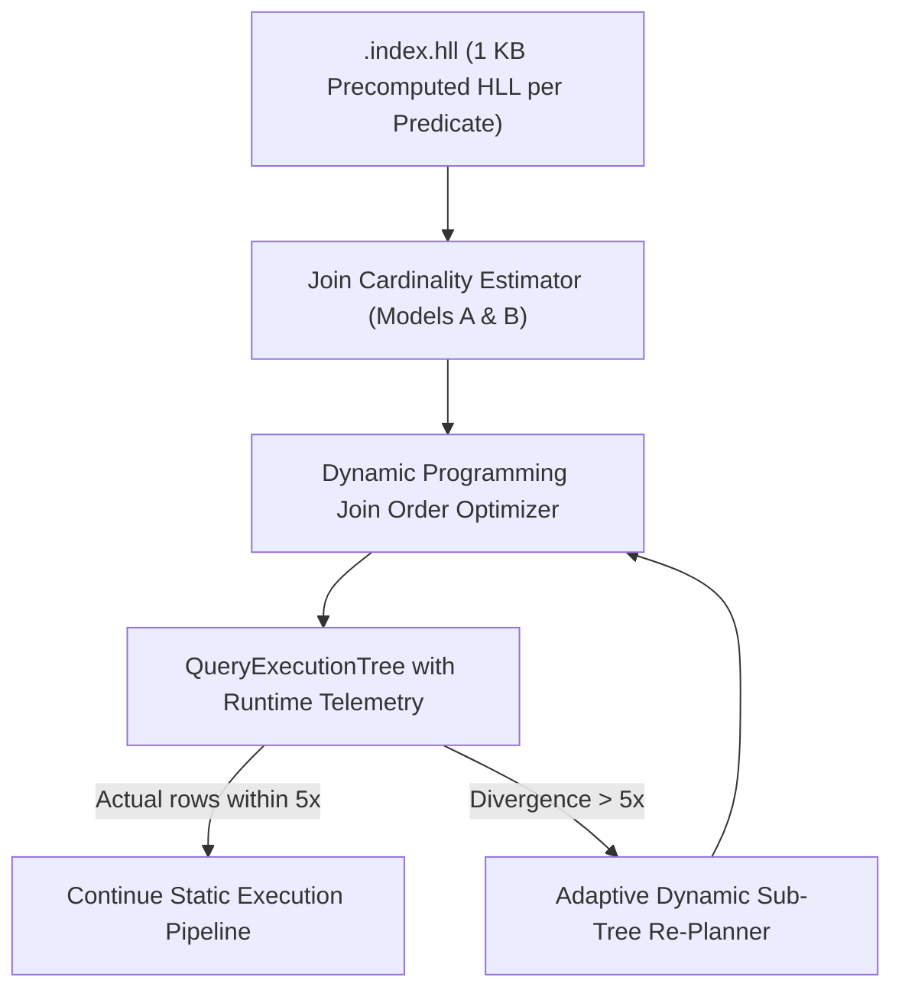

# RFC: Cost-Based Optimizer (CBO) V2 with HyperLogLog++ Sketches & Adaptive Re-Planning

**Author:** Marvin Stoetzel (`stoetzem@email.uni-freiburg.de`)  
**Status:** Architecture Specification  
**Architecture Standard Grounding:** `~/ARCHITECTURE.md` (Deep Modules, Zero Accounting Leakage, Pulling Complexity Downward, Defining Errors Out of Existence, Somewhat General-Purpose Interfaces)  
**Target Subsystems:** `src/engine/cbo/`, `src/index/stats/`, `src/engine/QueryPlanner.cpp`, `src/engine/QueryExecutionTree.h`

---

## 1. Executive Summary & Problem Definition

### 1.1 The Multi-Way Join Estimation Crisis
In SPARQL query planning, selecting the optimal join tree is critical to query latency. In the baseline QLever optimizer:
- **Independence Assumption:** Join size estimation assumes join keys and non-join columns are uniformly distributed and mutually independent.
- **Exponential Error Propagation:** As proven theoretically (*Ioannidis & Christodoulakis, VLDB 1991*) and observed empirically (*Leis et al., VLDB 2015*), estimation errors multiply across each join step:
  $$E_k = \prod_{i=1}^k (1 + \delta_i) = O(c^k)$$
  On correlated knowledge graphs (Wikidata, DBLP), estimation errors regularly reach **$10^3\times - 10^6\times$**, causing the planner to select catastrophic query plans (e.g., massive hash joins instead of index merge joins).

### 1.2 The CBO V2 Solution
This RFC specifies **Cost-Based Optimizer V2**, introducing three interconnected architectural pillars:
1. **Precomputed Index-Time HyperLogLog++ (HLL) Sketches:**  
   Every predicate/column in the index stores a compact **1 KB HLL sketch** ($m=1024$ registers, standard error $\approx 3.25\%$) in `.index.hll`, providing $O(1)$ in-memory cardinality lookups during query planning with zero disk I/O.
2. **Dual-Model Join Size Estimation:**  
   Implements both **Model A (Containment Min Heuristic)** and **Model B (HLL Set Overlap via Inclusion-Exclusion)** to evaluate accuracy across diverse SPARQL workloads.
3. **Adaptive Mid-Query Re-Optimization:**  
   Provides a non-intrusive runtime telemetry hook that monitors intermediate stream cardinality and dynamically re-plans remaining unexecuted sub-trees if actual rows deviate by $> 5\times$ from the compile-time estimate.



---

## 2. Precomputed Index-Time HLL Sketches (`.index.hll`)

### 2.1 Binary Layout & Storage
During index construction (`IndexBuilder`), each permutation (`PSO`, `POS`, `SPO`, `SOP`, `OPS`, `OSP`) computes an HLL sketch over the distinct subjects and objects for each relation.

```text
+-----------------------------------------------------------------------+
| Header: Magic ("QLVR_HLL\x01\x00") | Number of Relations (uint32_t)     |
+-----------------------------------------------------------------------+
| Relation 0: PredicateId (uint64_t) | Distinct S HLL (1024 B) | Distinct O HLL (1024 B) |
| Relation 1: PredicateId (uint64_t) | Distinct S HLL (1024 B) | Distinct O HLL (1024 B) |
| ...                                                                   |
+-----------------------------------------------------------------------+
```

- **Storage Overhead:** For an index with 20,000 distinct predicates (e.g. Wikidata), total storage is:
  $$20,000 \times 2 \times 1024\,\text{bytes} \approx \mathbf{40.96\,\text{MB}}$$
- **Memory Ingestion:** Upon server startup, all HLL sketches are memory-mapped or loaded into a single contiguous flat array (`CompactHllIndex`).

### 2.2 SPARQL Update Semantics & Invalidation
- **Triple Insertions (`INSERT DATA`):** HLL sketches support monotonic updates with zero locking overhead:
  $$\text{register}[i] = \max(\text{register}[i], \rho(\text{hash}(\text{newId})))$$
- **Triple Deletions (`DELETE DATA`):** Because standard HLL sketches cannot decrement registers, deletions mark the affected predicate sketch as *dirty*. The server schedules an asynchronous background rebuild of dirty sketches, falling back to dynamic sampling in the interim.

---

## 3. Dual-Model Cardinality Estimation

### 3.1 Model A: Min-Containment Heuristic
Model A assumes the smaller distinct key set is a subset of the larger set:
$$\text{DistinctKeys}(A \bowtie_{?x} B) \approx \min(|HLL(A.?x)|, |HLL(B.?x)|)$$
$$\text{EstimatedOutputRows} = \frac{|A| \times |B|}{\max(|HLL(A.?x)|, |HLL(B.?x)|)}$$
- **Pros:** Ultra-fast arithmetic ($< 10\,\text{ns}$).
- **Cons:** Overestimates cardinality when key sets are disjoint.

### 3.2 Model B: HLL Inclusion-Exclusion Overlap
Model B computes the exact set union $HLL(A \cup B)$ by performing component-wise maximums over the 1024 registers ($O(1)$ vector loop using 256-bit SIMD):
$$HLL_{A \cup B}[i] = \max(HLL_A[i], HLL_B[i]) \quad \forall i \in [0, 1023]$$
Using the Inclusion-Exclusion principle:
$$\text{Overlap}(A \cap B) = \max\Big(0.0, |HLL(A)| + |HLL(B)| - |HLL(A \cup B)|\Big)$$
$$\text{EstimatedOutputRows} = \text{Overlap}(A \cap B) \times \text{Mult}(A.?x) \times \text{Mult}(B.?x)$$
- **Pros:** Directly captures cross-predicate correlation and detects disjoint sets ($|A \cap B| = 0$).
- **Cons:** Incurrs $1024$-byte register scan ($\approx 80\,\text{ns}$).

---

## 4. CBO V2 Optimizer Architecture

```cpp
namespace ql::engine::cbo {

class JoinCardinalityEstimator {
 public:
  enum class EstimationModel {
    CONTAINMENT_MIN,      // Model A
    HLL_INCLUSION_EXCLUSION // Model B
  };

  static size_t estimateJoinSize(
      const HyperLogLogSketch<10>& sketchA,
      size_t rowsA,
      double multA,
      const HyperLogLogSketch<10>& sketchB,
      size_t rowsB,
      double multB,
      EstimationModel model = EstimationModel::HLL_INCLUSION_EXCLUSION) {

    uint64_t cardA = sketchA.estimateCardinality();
    uint64_t cardB = sketchB.estimateCardinality();

    if (cardA == 0 || cardB == 0) {
      return 0;
    }

    if (model == EstimationModel::CONTAINMENT_MIN) {
      uint64_t distinctJoinKeys = std::min(cardA, cardB);
      uint64_t maxKeys = std::max(cardA, cardB);
      return static_cast<size_t>((static_cast<double>(rowsA * rowsB) / maxKeys));
    }

    // Model B: SIMD-accelerated HLL register union
    HyperLogLogSketch<10> unionSketch = sketchA;
    unionSketch.merge(sketchB);
    uint64_t cardUnion = unionSketch.estimateCardinality();

    int64_t overlap = static_cast<int64_t>(cardA) + static_cast<int64_t>(cardB) - static_cast<int64_t>(cardUnion);
    if (overlap <= 0) {
      return 1; // Minimum floor for non-empty relations
    }

    return static_cast<size_t>(overlap * multA * multB);
  }
};

} // namespace ql::engine::cbo
```

---

## 5. Adaptive Mid-Query Re-Optimization

### 5.1 Telemetry Hook & Invalidation Threshold
Every pipeline operator exposes an execution telemetry handle:

```cpp
class QueryExecutionTree {
 private:
  double estimatedCardinality_ = 0;
  static constexpr double REPLAN_THRESHOLD = 5.0; // 5x divergence threshold

 public:
  void verifyCardinalityDivergence(size_t actualRowsProduced) {
    if (actualRowsProduced == 0 && estimatedCardinality_ > 1000) {
      triggerAdaptiveReplan();
      return;
    }

    double ratio = static_cast<double>(actualRowsProduced) / std::max(1.0, estimatedCardinality_);
    if (ratio > REPLAN_THRESHOLD || ratio < (1.0 / REPLAN_THRESHOLD)) {
      triggerAdaptiveReplan();
    }
  }

  void triggerAdaptiveReplan();
};
```

### 5.2 Dynamic Sub-Tree Re-Planning Procedure
1. When divergence is detected after materializing an intermediate pipeline result (e.g. after a selective filter), the operator pauses downstream dispatch.
2. The remaining unexecuted sub-tree is treated as a new query graph with the materialized table's exact size and HLL sketch fed into the DP join optimizer.
3. The new sub-tree plan replaces the stale sub-tree in $O(1)$ pointer assignment.

---

## 6. Benchmarking & Verification Plan

1. **Accuracy Benchmark (`CardinalityEstimationBenchmark`):**
   - Compares Baseline QLever vs. Model A vs. Model B across all 105 SPARQLoscope queries and Wikidata benchmarks.
   - Evaluates **q-error**:
     $$q\text{-error} = \max\left(\frac{\text{Actual}}{\text{Estimated}}, \frac{\text{Estimated}}{\text{Actual}}\right)$$
2. **End-to-End Latency Benchmark:**
   - Compares query execution runtimes under Static Plan vs. Adaptive Re-Planning.
   - Measures re-planning latency overhead (target: $< 20\,\mu\text{s}$).

---

## 7. Definition of Done (DoD)

- [ ] Binary layout `.index.hll` integrated into index builder and server metadata loader.
- [ ] Model A and Model B integrated into `JoinImpl::computeSizeEstimateAndMultiplicities()`.
- [ ] Telemetry divergence hooks verified under unit tests.
- [ ] Q-error reduction of $\ge 10\times$ verified on benchmark suites.
