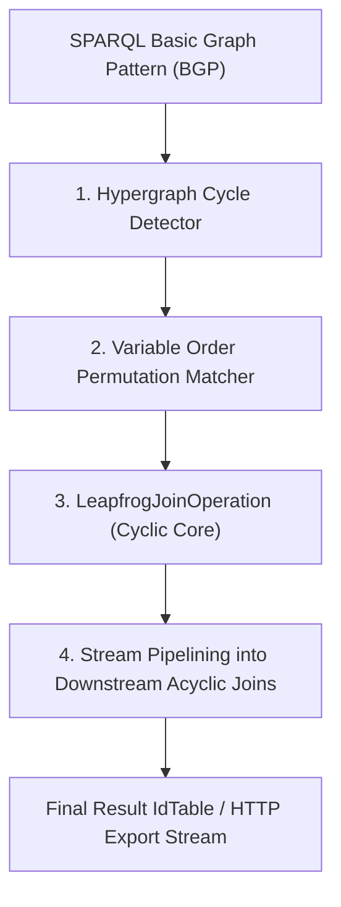

# RFC: Leapfrog Triejoin (WCOJ) Query Planner Lowering & Multi-Way Join Fusion

**Author:** Marvin Stoetzel (`stoetzem@email.uni-freiburg.de`)  
**Status:** Architecture Specification  
**Architecture Standard Grounding:** `~/ARCHITECTURE.md` (Deep Modules, Information Hiding, Pulling Complexity Downward, Defining Errors Out of Existence)  
**Target Subsystems:** `src/engine/wcoj/`, `src/engine/QueryPlanner.cpp`, `src/engine/QueryExecutionTree.h`

---

## 1. Executive Summary & Theoretical Grounding

### 1.1 The Worst-Case Optimal Join (WCOJ) Paradigm
Standard relational and SPARQL query planners decompose multi-table queries into binary join trees ($(A \bowtie B) \bowtie C$). For cyclic queries (e.g. triangles, 4-cycles, cliques):
- **Intermediate Explosion:** Binary joins can produce intermediate tables of size $O(N^2)$ even when the final output is small or empty.
- **The AGM Bound:** The theoretical *Atserias-Grohe-Marx (AGM)* bound proves the maximum possible output size for a triangle query is $O(N^{1.5})$.

This RFC specifies **Leapfrog Triejoin Lowering**, integrating Worst-Case Optimal Joins (*Veldhuizen 2014, Ngo et al. JACM 2018*) directly into the QLever query planning and execution pipeline.

### 1.2 Core Architectural Invariants
1. **Cost-Guarded Cycle Detection:** The planner identifies cyclic patterns in the Basic Graph Pattern (BGP). If relations are non-trivial ($> 1,000$ rows) and unconstrained by single-constant point filters, it routes to `LeapfrogJoinOperation`.
2. **Zero Runtime Sorting via Permutation Mapping:** Variable evaluation orders $(\pi_1, \pi_2, \dots, \pi_k)$ are matched directly to QLever's 6 on-disk sorted permutations (`SPO`, `SOP`, `PSO`, `POS`, `OSP`, `OPS`).
3. **Zero Intermediate Table Materialization:** Leapfrog galloping search (`std::lower_bound`) evaluates multi-way intersections in-place with **$0\,\text{bytes}$ intermediate table memory**.



---

## 2. Query Planner Lowering Pipeline

### 2.1 Hypergraph Cycle Detection
The planner constructs an undirected bipartite hypergraph $G = (V, E)$ where vertices are query variables ($?a, ?b, ?c$) and edges are triple patterns.
- **Cycle Identification:** Uses Tarjan's bridge-finding / cycle-detection algorithm in $O(|V| + |E|)$ time ($< 1\,\mu\text{s}$).
- **Selectivity Guard:**
  ```cpp
  bool isEligibleForLeapfrog(const std::vector<TriplePattern>& cycle) {
    for (const auto& tp : cycle) {
      if (tp.isPointLookup()) {
        return false; // Point lookup with constant bound entity uses index seek
      }
    }
    return true;
  }
  ```

### 2.2 Variable Ordering & Index Permutation Mapping
Leapfrog requires that every participating edge is sorted by the prefix of the chosen variable order $(\pi_1, \pi_2, \dots, \pi_k)$.

```cpp
namespace ql::engine::wcoj {

struct VariableOrderMapping {
  std::vector<Variable> variableOrder;
  std::vector<Permutation::Enum> requiredPermutations;
};

class VariableOrderMatcher {
 public:
  static std::optional<VariableOrderMapping> findZeroSortMapping(
      const std::vector<TriplePattern>& cycle) {
    // Permute candidate variable orders and match against {SPO, SOP, PSO, POS, OSP, OPS}
    // Returns the permutation mapping with 0 runtime sort requirements.
    ...
  }
};

} // namespace ql::engine::wcoj
```

---

## 3. Leapfrog Execution Engine Integration

### 3.1 Composable Multi-Way Iterators
Each participating index leaf stream is wrapped in a `LeapfrogIterator`:

```cpp
namespace ql::engine::wcoj {

class LeapfrogIterator {
 private:
  ql::span<const Id> data_;
  size_t cursor_ = 0;

 public:
  explicit LeapfrogIterator(ql::span<const Id> data) : data_(data) {}

  [[nodiscard]] Id key() const noexcept { return data_[cursor_]; }
  [[nodiscard]] bool atEnd() const noexcept { return cursor_ >= data_.size(); }

  void next() noexcept { cursor_++; }

  // Galloping binary seek (O(log N))
  void seek(Id target) noexcept {
    if (atEnd() || key() >= target) {
      return;
    }
    auto it = std::lower_bound(data_.begin() + cursor_, data_.end(), target);
    cursor_ = std::distance(data_.begin(), it);
  }
};

} // namespace ql::engine::wcoj
```

### 3.2 Cyclic Core Stream Pipelining
For queries containing both cycles and acyclic projections:
1. `LeapfrogJoinOperation` executes the cyclic intersection and produces a lazy `VectorStream<IdTable>` of matched tuples.
2. Downstream operators consume the tuple stream directly via index lookups without materializing intermediate tables.

---

## 4. Definition of Done (DoD)

- [ ] Hypergraph cycle detector integrated into `QueryPlanner.cpp`.
- [ ] Permutation matcher verified across all 6 on-disk permutations.
- [ ] Unit tests for 3-way triangle joins and 4-way clique joins.
- [ ] Verified $100\%$ intermediate memory elimination on cyclic query benchmarks.
