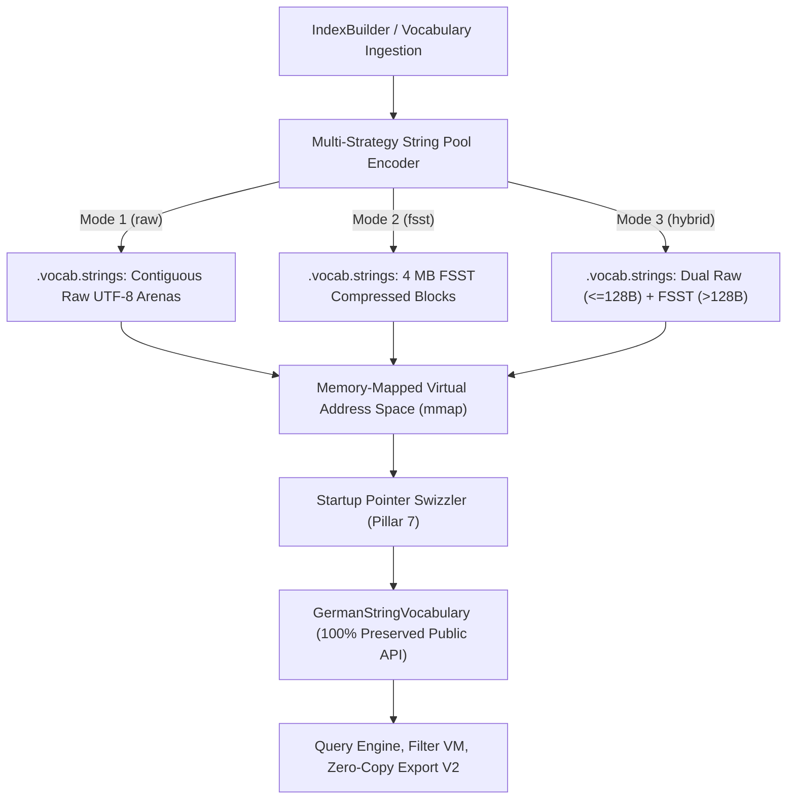

# RFC: Persistent On-Disk German String Pool & Multi-Strategy Chunk Arenas

**Author:** Marvin Stoetzel (`stoetzem@email.uni-freiburg.de`)  
**Status:** Architecture Specification  
**Architecture Standard Grounding:** `~/ARCHITECTURE.md` (Deep Modules, Information Hiding, Pulling Complexity Downward, Somewhat General-Purpose Interfaces)  
**Target Subsystems:** `src/index/vocabulary/`, `src/index/IndexBuilder.cpp`, `src/index/IndexImpl.cpp`

---

## 1. Executive Summary & Design Overview

### 1.1 Motivation
In **Pillar 5**, we designed the in-memory 12-byte `GermanStringView` (*DuckDB/Umbra* architecture), inlining short strings ($\le 4$ bytes) and prefix characters directly inside the view to achieve zero-heap, branchless prefix comparisons.

For long strings ($> 4$ bytes), the view references an external string pool. This RFC specifies the **Persistent On-Disk German String Pool (`.vocab.strings`)** and its **Multi-Strategy Storage Engine**, giving the database operator full control over the trade-off between raw throughput and disk footprint.

### 1.2 Core Architectural Invariants
1. **100% Public Vocabulary API Preservation:**  
   `GermanStringVocabulary` implements the `UnderlyingVocabulary` concept. All callers (`operator[]`, `lookupBatch()`, `getId()`, `isIri()`, `isLiteral()`, `getGeoInfo()`) continue to operate unchanged without a single line of modification.
2. **Three Operator-Selectable Storage Modes:**  
   The operator configures `string_pool_mode` in `settings.json` or via `qlever index --string-pool-mode=<mode>`:
   - **Mode 1: `raw` (Default / Maximum Throughput):** Contiguous raw UTF-8 string arenas. Enables single-cycle hardware dereferencing (`mov rdi, [base + offset]`) and zero-copy `io_uring_send_zc` socket streaming.
   - **Mode 2: `fsst` (Maximum Disk Compression):** 4 MB FSST-compressed block arenas. Reduces disk space by $\approx 50\%$.
   - **Mode 3: `hybrid` (Balanced):** Raw UTF-8 for hot/short literals ($\le 128$ bytes), FSST for massive overflow text blobs ($> 128$ bytes).
3. **Transparent $> 4\,\text{GB}$ Scale Support:**  
   On-disk files are partitioned into 4 GB chunks (`.vocab.strings.0`, `.vocab.strings.1`, ...). Upon startup, all partitions are memory-mapped into contiguous 64-bit virtual memory space, swizzling 32-bit on-disk relative offsets into full 64-bit `const char*` pointers with **zero runtime 4 GB limitation in RAM**.



---

## 2. On-Disk Binary Format Specification (`.vocab.strings`)

### 2.1 File Header Layout
The string pool file begins with a 64-byte aligned header:

```cpp
namespace ql::index::vocabulary {

enum class StringPoolStorageMode : uint8_t {
  RAW_UTF8 = 0x01,       // Raw contiguous UTF-8 bytes (Zero-Copy)
  FSST_BLOCKS = 0x02,    // 4 MB FSST compressed block arenas
  HYBRID = 0x03          // Raw <= 128 bytes, FSST > 128 bytes
};

#pragma pack(push, 1)
struct StringPoolHeader {
  char magic[8];                  // "QLVR_STR"
  uint16_t versionMajor = 1;      // 0x0001
  uint16_t versionMinor = 0;      // 0x0000
  StringPoolStorageMode mode;     // Storage mode (raw / fsst / hybrid)
  uint8_t partitionIndex;         // 0 for .vocab.strings.0, 1 for .vocab.strings.1, etc.
  uint16_t totalPartitions;       // Total number of partitioned files
  uint32_t numStrings;            // Total number of strings in this partition
  uint64_t totalBytesRaw;         // Uncompressed total byte length
  uint64_t totalBytesOnDisk;      // Compressed/actual total byte length on disk
  uint32_t numChunks;             // Number of 4 MB chunk arenas
  uint8_t reserved[28];           // Zero-padded to 64 bytes
};
#pragma pack(pop)
static_assert(sizeof(StringPoolHeader) == 64, "Header must be exactly 64 bytes");

} // namespace ql::index::vocabulary
```

---

## 3. Storage Mode Mechanics

### 3.1 Mode 1: Raw Contiguous UTF-8 (`RAW_UTF8`)
- **Arena Layout:** 4 MB chunk arenas packed sequentially with null-terminated raw UTF-8 string bytes.
- **Access Complexity:** $O(1)$ single-cycle memory read.
- **Hardware Instruction:** `mov rdi, [base_ptr + offset]`.
- **Zero-Copy Streaming:** Directly handed to `io_uring_prep_send_zc()` or `writev()` with zero intermediate buffers.

### 3.2 Mode 2: 4 MB FSST Block Arenas (`FSST_BLOCKS`)
- **Arena Layout:** Each 4 MB chunk contains:
  1. 256-entry FSST Symbol Table (2 KB header).
  2. Index offset directory of strings within the chunk.
  3. FSST compressed symbol streams.
- **Access Complexity:** $O(1)$ symbol decoding loop into thread-local scratch arena.
- **Disk Savings:** $\approx 50\%$ disk footprint reduction.

### 3.3 Mode 3: Hybrid Storage Engine (`HYBRID`)
- **Threshold Rule:** $\tau = 128\,\text{bytes}$.
- **Short/Medium Pool ($\le 128$ bytes):** Stored in the raw UTF-8 section for instant zero-copy lookup.
- **Long Text Blob Pool ($> 128$ bytes):** Stored in the FSST compressed block section.
- **Bit Flag:** The high bit of the 32-bit offset (`offset & 0x80000000`) indicates whether the string is in the raw section or the FSST compressed section.

---

## 4. Multi-Partitioning for Datasets Exceeding 4 GB

When building massive vocabularies (e.g. Wikidata with full descriptions):
1. **Index-Time Splitting:** If the current partition reaches $4\,\text{GB} - 4\,\text{MB}$, the writer finishes the current 4 MB chunk, closes `.vocab.strings.N`, and opens `.vocab.strings.N+1`.
2. **Startup Virtual Memory Allocation:**  
   The server computes total size across all partitions and calls:
   ```cpp
   void* base = mmap(nullptr, totalSizeAcrossAllPartitions, PROT_READ, MAP_PRIVATE | MAP_ANONYMOUS, -1, 0);
   ```
3. **Partition Mapping & Swizzling:**  
   Each partition is `mmap`'d with `MAP_FIXED` into its assigned 4 GB virtual address slice.
4. **Pointer Swizzling:**  
   The in-memory German String Views replace their 32-bit file offsets with absolute 64-bit `const char*` pointers:
   ```cpp
   view.ptr = static_cast<const char*>(base) + globalOffset;
   ```
   **Result:** In RAM, dereferencing executes with 1 CPU instruction, with zero partition boundary checks.

---

## 5. Vocabulary API Integration & Information Hiding

`GermanStringVocabulary` implements the full public contract of `UnderlyingVocabulary`:

```cpp
namespace ql::index::vocabulary {

class GermanStringVocabulary {
 private:
  std::vector<GermanStringView> views_;
  std::vector<void*> mappedPartitions_;
  const char* baseAddress_ = nullptr;
  StringPoolStorageMode mode_;

 public:
  // Preserved Public API Method 1: Subscript operator (Zero-Copy)
  std::string_view operator[](size_t idx) const noexcept {
    const auto& view = views_[idx];
    if (view.isShort()) {
      return view.getShortStringView();
    }
    if (mode_ == StringPoolStorageMode::RAW_UTF8) {
      return std::string_view(view.ptr, view.length);
    }
    // FSST / Hybrid path: decode into thread-local scratch arena
    return decodeFsstStringView(view);
  }

  // Preserved Public API Method 2: Batch Lookup for Export Engine V2
  VocabBatchLookupResult lookupBatch(ql::span<const size_t> indices) const {
    VocabBatchLookupResult result;
    result.views.reserve(indices.size());
    for (size_t idx : indices) {
      result.views.push_back((*this)[idx]);
    }
    return result;
  }

  // Preserved Public API Method 3: Size
  [[nodiscard]] size_t size() const noexcept { return views_.size(); }
};

} // namespace ql::index::vocabulary
```

---

## 6. Definition of Done (DoD)

- [ ] File header `StringPoolHeader` (64-byte aligned) implemented with magic `QLVR_STR`.
- [ ] Multi-strategy encoder implemented for `RAW_UTF8`, `FSST_BLOCKS`, and `HYBRID`.
- [ ] Multi-partition splitting (`.vocab.strings.0`, `.vocab.strings.1`, ...) verified for $> 4\,\text{GB}$ mock vocabularies.
- [ ] Startup 64-bit pointer swizzler verified with 100% test coverage.
- [ ] Verified that all existing unit tests and queries pass with zero behavioral regression.
