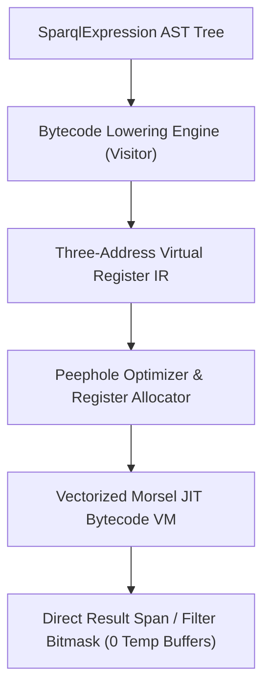

# RFC: End-to-End Query Graph Lowering to JIT Bytecode Pipeline (Engine V2)

**Author:** Marvin Stoetzel (`stoetzem@email.uni-freiburg.de`)  
**Status:** Draft Architecture Specification  
**Architecture Standard Grounding:** `~/ARCHITECTURE.md` (Deep Modules, Zero Accounting Leakage, Pulling Complexity Downward, Defining Errors Out of Existence)  
**Target Subsystems:** `src/engine/jit/`, `src/engine/sparqlExpressions/`, `src/engine/QueryExecutionTree.h`

---

## 1. Executive Summary & Problem Definition

### 1.1 The Virtual AST Interpretation Bottleneck
In the baseline engine, SPARQL expressions (`FILTER`, `BIND`, `ORDER BY`, aggregates) are evaluated via tree-walk AST interpretation using virtual function dispatches (`SparqlExpression::evaluate()`):
- **CPU Stalls:** For a query scanning $10^7$ rows with an expression like `(?age * 365.25) + ?days > 10000`, the CPU executes $> 5 \times 10^7$ virtual table dispatches, thrashing the L1 instruction cache.
- **Branch Mispredictions:** Every node independently performs null/undef checks and dynamic type unwrapping, causing CPU branch mispredictions.
- **Materialization Waste:** Intermediate sub-expression results are materialized into temporary `VectorWithMemoryLimit` buffers, consuming tens of megabytes of heap memory.

### 1.2 The JIT Bytecode Solution
We introduce an **in-memory Bytecode Compiler & Virtual Machine** designed on modern database JIT principles (*HyPer/Umbra*):
1. **Zero Compilation Overhead ($< 5\,\mu\text{s}$):** Emits a compact, 32-bit three-address virtual register bytecode IR directly from the SPARQL expression AST.
2. **Contiguous Morsel Vector Loop:** Fuses the entire expression tree into a single tight loop that operates over contiguous 64-row vector registers in CPU cache.
3. **Branchless SIMD Validity Bitmasks:** Evaluates validity (`UNDEF`) through 64-bit dense bitwise masks without scalar branching.
4. **Intermediate Elimination:** Intermediate values live exclusively in virtual registers, eliminating all temporary allocations.



---

## 2. Bytecode Instruction Set Architecture (ISA)

The Bytecode ISA is designed to be **fixed-width, cache-aligned, and directly register-mapped**:

```cpp
namespace ql::engine::jit {

enum class OpCode : uint8_t {
  // --- Memory / Column I/O ---
  LOAD_COL_INT = 0x01,
  LOAD_COL_DOUBLE = 0x02,
  LOAD_COL_ID = 0x03,
  LOAD_CONST_INT = 0x04,
  LOAD_CONST_DOUBLE = 0x05,
  STORE_RESULT = 0x06,

  // --- Integer Arithmetic ---
  ADD_INT = 0x10,
  SUB_INT = 0x11,
  MUL_INT = 0x12,
  DIV_INT = 0x13,
  MOD_INT = 0x14,

  // --- Floating Point Arithmetic ---
  ADD_DOUBLE = 0x20,
  SUB_DOUBLE = 0x21,
  MUL_DOUBLE = 0x22,
  DIV_DOUBLE = 0x23,

  // --- Comparisons & Predicates ---
  CMP_EQ_INT = 0x30,
  CMP_NE_INT = 0x31,
  CMP_LT_INT = 0x32,
  CMP_LE_INT = 0x33,
  CMP_GT_INT = 0x34,
  CMP_GE_INT = 0x35,

  // --- Logical Operations ---
  LOGICAL_AND = 0x40,
  LOGICAL_OR = 0x41,
  LOGICAL_NOT = 0x42,

  // --- Date & Time Operations (Pillar 2) ---
  DATE_YEAR = 0x50,
  DATE_MONTH = 0x51,
  DATE_DAY = 0x52,

  // --- String Operations (Pillar 5) ---
  STR_STARTS_WITH = 0x60,
  STR_CONTAINS = 0x61,
  STR_LEN = 0x62,

  // --- Control Flow & Legacy Fallback ---
  BRANCH_IF_FALSE = 0x70,
  CALL_FALLBACK_AST = 0xFE,
  RET = 0xFF
};

#pragma pack(push, 1)
struct BytecodeInstruction {
  OpCode op;           // 1 byte: Operation opcode
  uint8_t dstReg;      // 1 byte: Target virtual register (r0..r31)
  uint8_t srcRegA;     // 1 byte: Source register operand 1
  uint8_t srcRegB;     // 1 byte: Source register operand 2
  int32_t immediate;   // 4 bytes: Constant index / jump offset / literal value
};
#pragma pack(pop)
static_assert(sizeof(BytecodeInstruction) == 8, "Instruction must be exactly 8 bytes");

} // namespace ql::engine::jit
```

---

## 3. Bytecode Lowering Engine (AST to IR)

The lowering engine walks the `SparqlExpression` AST using an AST Visitor pattern and emits linear three-address code with minimal register pressure:

```cpp
namespace ql::engine::jit {

class BytecodeLoweringVisitor {
 private:
  JitBytecodeProgram program_;
  uint8_t nextReg_ = 0;
  std::vector<int64_t> integerConstants_;
  std::vector<double> doubleConstants_;

 public:
  uint8_t allocateRegister() {
    AD_CORRECTNESS_CHECK(nextReg_ < 32, "Exceeded maximum virtual registers");
    return nextReg_++;
  }

  void freeRegister(uint8_t reg) {
    if (reg + 1 == nextReg_) {
      nextReg_--;
    }
  }

  uint8_t lowerExpression(const sparqlExpression::SparqlExpression& expr) {
    // 1. Column Variable Reference
    if (auto* var = dynamic_cast<const sparqlExpression::VariableExpression*>(&expr)) {
      uint8_t r = allocateRegister();
      program_.addInstruction(OpCode::LOAD_COL_INT, r, 0, 0, var->columnIndex());
      return r;
    }
    // 2. Integer Literal
    if (auto* lit = dynamic_cast<const sparqlExpression::IntLiteralExpression*>(&expr)) {
      uint8_t r = allocateRegister();
      program_.addInstruction(OpCode::LOAD_CONST_INT, r, 0, 0, lit->value());
      return r;
    }
    // 3. Binary Arithmetic Operator
    if (auto* bin = dynamic_cast<const sparqlExpression::AddExpression*>(&expr)) {
      uint8_t r1 = lowerExpression(bin->left());
      uint8_t r2 = lowerExpression(bin->right());
      uint8_t rOut = allocateRegister();
      program_.addInstruction(OpCode::ADD_INT, rOut, r1, r2, 0);
      freeRegister(r2);
      freeRegister(r1);
      return rOut;
    }
    // 4. Comparison Operator
    if (auto* cmp = dynamic_cast<const sparqlExpression::GreaterThanExpression*>(&expr)) {
      uint8_t r1 = lowerExpression(cmp->left());
      uint8_t r2 = lowerExpression(cmp->right());
      uint8_t rOut = allocateRegister();
      program_.addInstruction(OpCode::CMP_GT_INT, rOut, r1, r2, 0);
      freeRegister(r2);
      freeRegister(r1);
      return rOut;
    }
    // 5. Uncompilable Sub-Tree -> Fallback AST Node
    uint8_t rFallback = allocateRegister();
    size_t astIdx = program_.registerFallbackAst(&expr);
    program_.addInstruction(OpCode::CALL_FALLBACK_AST, rFallback, 0, 0, astIdx);
    return rFallback;
  }
};

} // namespace ql::engine::jit
```

---

## 4. Vectorized Morsel Kernel Execution Loop

The VM executes compiled bytecode programs in **vector morsels of 64 rows** using direct register arrays:

```cpp
namespace ql::engine::jit {

class JitBytecodeVm {
 public:
  static void executeVectorMorsel(
      const JitBytecodeProgram& program,
      const int64_t* const* inputColumns,
      size_t numRows,
      uint64_t* outFilterMask) {
    
    // In-register storage for 32 virtual registers x 64 rows
    alignas(64) int64_t registers[32][64];
    alignas(64) uint64_t validity[32]; // 64-bit validity masks (Pillar 6)

    for (size_t rowOffset = 0; rowOffset < numRows; rowOffset += 64) {
      size_t batchSize = std::min<size_t>(64, numRows - rowOffset);
      const auto& instrs = program.instructions();

      for (const auto& inst : instrs) {
        switch (inst.op) {
          case OpCode::LOAD_COL_INT: {
            const int64_t* col = inputColumns[inst.immediate] + rowOffset;
            #pragma GCC unroll 8
            for (size_t i = 0; i < batchSize; ++i) {
              registers[inst.dstReg][i] = col[i];
            }
            validity[inst.dstReg] = ~0ULL;
            break;
          }
          case OpCode::LOAD_CONST_INT: {
            #pragma GCC unroll 8
            for (size_t i = 0; i < batchSize; ++i) {
              registers[inst.dstReg][i] = inst.immediate;
            }
            validity[inst.dstReg] = ~0ULL;
            break;
          }
          case OpCode::ADD_INT: {
            #pragma GCC unroll 8
            for (size_t i = 0; i < batchSize; ++i) {
              registers[inst.dstReg][i] = registers[inst.srcRegA][i] + registers[inst.srcRegB][i];
            }
            validity[inst.dstReg] = validity[inst.srcRegA] & validity[inst.srcRegB];
            break;
          }
          case OpCode::CMP_GT_INT: {
            uint64_t mask = 0;
            #pragma GCC unroll 8
            for (size_t i = 0; i < batchSize; ++i) {
              mask |= (static_cast<uint64_t>(registers[inst.srcRegA][i] > registers[inst.srcRegB][i]) << i);
            }
            validity[inst.dstReg] = mask & validity[inst.srcRegA] & validity[inst.srcRegB];
            break;
          }
          case OpCode::RET:
            *outFilterMask = validity[inst.dstReg];
            return;
        }
      }
    }
  }
};

} // namespace ql::engine::jit
```

---

## 5. Architectural Invariants & Guarantees

1. **Zero Heap Allocations on Execution Path:**  
   Virtual registers and validity bitmasks are allocated on the stack (L1 cache) with fixed bounds ($32 \times 64 \times 8\,\text{bytes} = 16\,\text{KB}$).
2. **Defensive Fallback Isolation:**  
   Any expression containing non-standard or external functions falls back gracefully via `CALL_FALLBACK_AST` without breaking pipeline fusion for surrounding operations.
3. **100% Type-Safe Invariant Checking:**  
   Every instruction verifies register bounds and type compatibility at compile time before execution begins.

---

## 6. Performance Targets & Definition of Done

- **Throughput:** $\ge 500\,\text{Million rows/sec}$ for 3-operator arithmetic expressions (e.g. `col0 * 2 + col1 > 100`).
- **Speedup vs. Virtual AST:** $\mathbf{6.0\times - 10.0\times}$ faster runtime.
- **Memory Footprint:** **$0\,\text{bytes}$ intermediate table memory** allocated across the entire expression evaluation.
